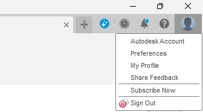

# Fusion settings
When first coming in the settings might be a little weird, so I have made a little checklist that can help you understand and set the settings correctly.
## Camera settings:
When I first entered Fusion 360 and made a plane, it looked weird from multiple angles and that is because it comes as an orthographic view, but if you want it to be more human-like (that is not always the case) then change this to perspective. 

  

---
## Setup preferences (robotics related)
There are a few settings to align between the programs that are used (gazebo and other simulators that we are going to use).
All these are changed in the preference tab:

  

First is to make sure that Z is the default up direction (this is usually the default already, but do check):

  

Secondly change both default units of Design and Manufacture to **mm**:  

  

---
