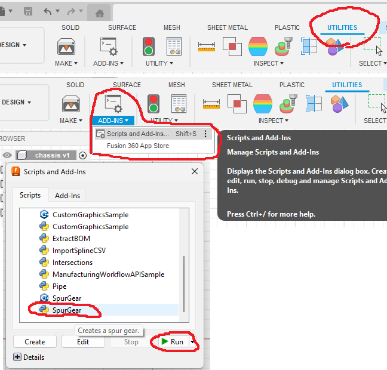

# Learn to make gears

###### Spur gear
Fusion 360 comes with a custom script for generating spur gears. 
To activate go to: Utilities > ADD-INS > Scripts and Add-Ins > SpurGear > Run.

  

## Links to learning material
1. [(YT): Create Spur Gears in Fusion 360](https://www.youtube.com/watch?v=B8A_11o7QZ0)
2. 